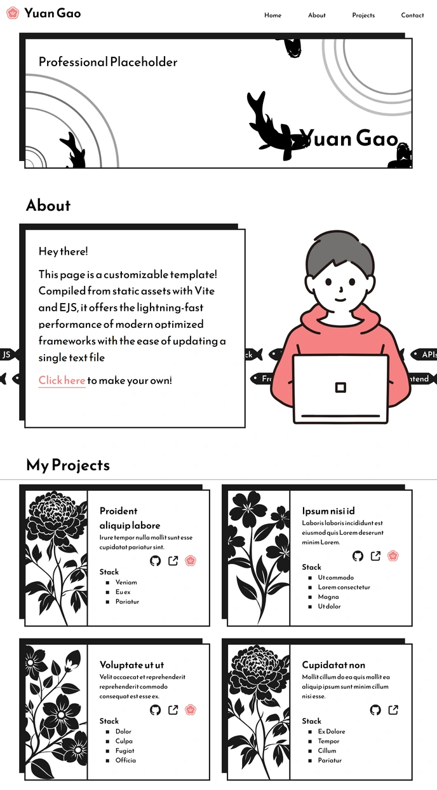

# My Portfolio

A showcase of all of my projects and their tech stacks, updateable from a single file.

This portfolio currently uses my Monokoi design template, which is available as a free and open source template under the GNU GPLv3 license. [Click here](https://github.com/cyphersept/monokoi-template) for the template and setup instructions.

## Links

**Live Site:** [http://www.cyphersept.github.io](http://www.cyphersept.github.io)

**Template:** [https://github.com/cyphersept/monokoi-template](https://github.com/cyphersept/monokoi-template)

## About

After making manual edits to update my portfolio for the 5th time, I finally bit the bullet and spent 20 hours on a solution for a problem that takes me two minutes.

The information on the page, including the title, description, skills, project list, and links are all compiled into a static site using the information in \[contents.js\](contents.js) and the EJS template layout. The layout itself was then further optimized for initial load time and SEO performance.

## **Tech Stack**

- EJS via \`vite-plugin-ejs\` for templating
- Vite for compiling and bundling
- HTML, CSS, and JavaScript

## Credits

CSS reset courtesy of [Josh Comeau](https://www.joshwcomeau.com/css/custom-css-reset/).

Site icon and assorted UI icons from [SVG Repo](https://www.svgrepo.com).

Koi fish vectors from [The Noun Project.](https://thenounproject.com/creator/renzokbanget/)

Monochrome flower vectors from [Vecteezy.](https://www.vecteezy.com)
